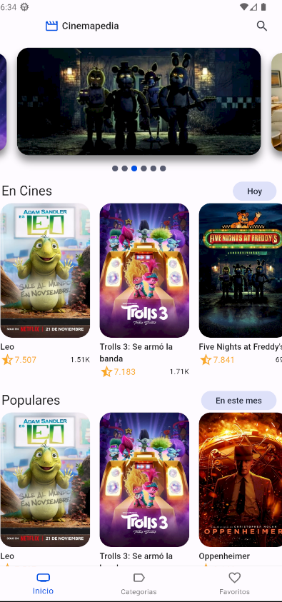
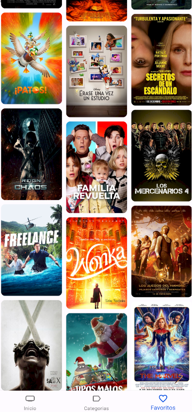

# CINEMAPEDIA

Este es un nuevo proyecto de Flutter.
En este proyecto utilizamos la API de The Movie DB para poder consultar y tener informacion referente a la cartelera de los Cines del mundo.

Tambien ponemos en practica el manejo de estados, creacion de Gidgets personalizados, manejo de temas , almacenamiento local de informacion con Isar y manejo de animaciones con el paquete aimate_do

**Para ejectur el proyecto**

1. Copiar el .env.template y renombrarlo a .env
2. Cambiar las variables de entorno (The Movie DB)
3. Canbios en la entidad, hay que ejecutar el cmando
```
flutter pub run build_runner build
```

**Vistas del proyecto**

1. Vista principal




2. Vista principal


3. Vista de favoritos


